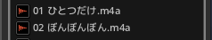

Japanese L10N Pack for Bitwig Studio
================

Japanse localization pack for Bitwig Studio.

### Build and Install

Modify pom.xml to suit your environment.

```
    mvn integration-test
```
Or you can also download recently build from [here](https://www.dropbox.com/sh/6stkj1n9670qvx8/AAAnXeUKrLX4nreH8sQhvuCqa).

* Mac OSX
```
/Applications/Bitwig Studio.app/Contents/PlugIns/JavaVM.plugin/Contents/Home/lib/ext/bitwig-japanese-pack-${version}.jar
/Applications/Bitwig Studio.app/Contents/Resources/localization/Bitwig Studio-resources_ja.properties
/Applications/Bitwig Studio.app/Contents/Resources/localization/GUIApplication-resources_ja.properties
```

* Windows
```
```

* Linux
```
```
### Workaround for OSX NFD file name issue
- Bitwig Studio running with jre1.7(default)

 ")

- Bitwig Studio running with jre8

 

 Install JDK8 and run following commands:
```
  mv /Applications/Bitwig\ Studio.app/Contents/PlugIns/JavaVM.plugin/Contents/Home /Applications/Bitwig\ Studio.app/Contents/PlugIns/JavaVM.plugin/Contents/Home.jdk7
  cp -r /Library/Java/JavaVirtualMachines/jdk1.8.0_20.jdk/Contents/Home/jre /Applications/Bitwig\ Studio.app/Contents/PlugIns/JavaVM.plugin/Contents/Home
```
and finally reinstall bitwig-japanese-pack.  
